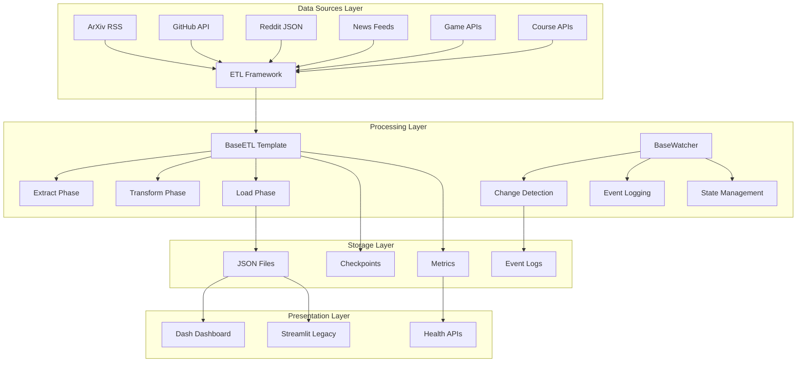

# Watchtower Architecture Overview

## System Architecture

Watchtower (MEGALITH) is a sophisticated data intelligence platform built around a three-tier architecture that prioritizes scalability, maintainability, and performance.



## Core Design Principles

### 1. Template Method Pattern
The `BaseETL` class implements a template method pattern that standardizes the ETL workflow while allowing customization of each phase:

```python
class BaseETL(ABC, Generic[InputType, OutputType]):
    def run(self) -> ETLMetrics:
        extracted = self.extract()      # Customizable
        transformed = self.transform(extracted)  # Customizable  
        self.load(transformed)          # Customizable
        return self.metrics
```

### 2. Event-Driven Architecture
Watchers implement an event-driven pattern for continuous monitoring:

- **State Persistence**: JSON-based checkpoints for resumable operations
- **Event Logging**: Timestamped change records for audit trails
- **Configurable Triggers**: Custom logic for determining significant changes

### 3. File-Based Storage Strategy
JSON files provide optimal performance for read-heavy dashboard operations:

- **Fast Read Access**: No database overhead for dashboard queries
- **Timestamped Archives**: Historical data preservation with automatic cleanup  
- **Latest File Pattern**: Always-current `*_latest.json` files for dashboards
- **Cross-platform Compatibility**: Works identically on Windows/Linux/MacOS

## Component Architecture

### ETL Framework (`src/etl/`)

The ETL framework is built around the `BaseETL` abstract base class with the following features:

#### Core Features
- **Metrics Collection**: Built-in performance tracking with `ETLMetrics`
- **Checkpointing**: Resumable operations for long-running processes
- **Retry Logic**: Exponential backoff for transient failures
- **Batch Processing**: Memory-efficient processing of large datasets
- **Validation**: Pydantic model validation with detailed error reporting

#### Specializations
- **SimpleETL**: Basic ETL for straightforward data processing
- **DataFrameETL**: Pandas-based ETL for complex data transformations
- **Custom ETLs**: Domain-specific implementations for each data source

### Watcher System (`src/watchers/`)

Watchers provide continuous monitoring capabilities:

#### Features
- **Abstract Base**: `BaseWatcher` defines the monitoring interface
- **State Management**: Persistent state in `data/watchers/{name}/state.json`
- **Event Recording**: Change events in `data/watchers/{name}/events/`
- **Configurable Intervals**: Flexible polling frequencies
- **Error Resilience**: Continues operation despite individual failures

#### Implementation Pattern
```python
class CustomWatcher(BaseWatcher):
    def extract_value(self, content: str) -> Any:
        # Extract the value to monitor
        return parsed_value
    
    def has_changed(self, old_value: Any, new_value: Any) -> bool:
        # Determine if change is significant
        return significant_change_detected
```

### Dashboard Architecture (`src/web/dashboard/`)

The dashboard uses a modern tab-based architecture with Bootstrap styling:

#### Key Components
- **Main App** (`app.py`): Tab container and global configuration
- **Tab Components** (`components/`): Modular UI components with individual callbacks
- **Health APIs**: `/health` and `/metrics` endpoints for monitoring
- **Asset Management**: CSS and static files in `assets/`

#### Performance Patterns
- **Single Callback Pattern**: One callback per output prevents conflicts
- **Lazy Loading**: Data loaded on-demand for better performance
- **Error Boundaries**: Graceful degradation with user-friendly messages
- **Caching Strategies**: Multiple levels of data caching

### Configuration System (`src/config/`)

Centralized configuration using Pydantic Settings:

#### Features
- **Nested Configuration**: Component-specific config classes
- **Environment Variables**: Support for `COMPONENT__SETTING` format
- **Auto-discovery**: Automatic project root detection
- **Type Validation**: Full Pydantic validation with custom validators
- **Path Management**: Automatic conversion to absolute paths

#### Configuration Hierarchy
```python
Settings
├── DatabaseConfig
├── LoggingConfig  
├── ETLConfig
├── ScrapingConfig
├── APIConfig
└── Component-specific configs
```

### Data Models (`src/models/`)

Pydantic-based models provide type safety and validation:

#### Base Models
- **TimestampedModel**: Automatic ID, created_at, updated_at fields
- **StatusModel**: Status tracking with contextual information
- **ErrorModel**: Comprehensive error context and tracebacks
- **PaginationModel**: Automatic pagination calculations

#### Domain Models
Each data domain has specialized models:
- **ArxivPaperModel**: Research papers with classification
- **NewsArticleModel**: News articles with source attribution
- **GameDealModel**: Game pricing and availability
- **CourseModel**: Educational content with reviews

## Data Flow Architecture

### ETL Data Flow
```
1. Data Source → 2. Extract → 3. Transform → 4. Load → 5. Storage
                     ↓            ↓           ↓         ↓
                  Raw Data → Processed → Validated → JSON Files
                     ↓            ↓           ↓         ↓
                 Checkpoints → Metrics → Events → Dashboard
```

### Watcher Data Flow
```
1. Monitor → 2. Extract Value → 3. Compare → 4. Event → 5. State Update
     ↓             ↓              ↓          ↓           ↓
  Scheduled →   Current Value → Changed? → Log Event → Persist
```

### Dashboard Data Flow
```
1. User Request → 2. Load Data → 3. Process → 4. Render → 5. Display
       ↓             ↓            ↓          ↓           ↓
   Tab Selection → JSON Files → Filter/Sort → HTML → Browser
```

## Performance Architecture

### Optimization Strategies

#### 1. Storage Optimization
- **JSON Storage**: Optimized for read-heavy dashboard operations
- **File Structure**: Predictable paths for efficient data location
- **Compression**: Optional gzip compression for large datasets
- **Cleanup**: Automatic retention management for old files

#### 2. Processing Optimization
- **Batch Processing**: Configurable batch sizes for memory efficiency
- **Parallel Execution**: Multiple ETLs run concurrently
- **Lazy Loading**: Data loaded on-demand in dashboard components
- **Caching**: Multiple cache layers for frequently accessed data

#### 3. Memory Management
- **Generator Patterns**: Memory-efficient iteration over large datasets
- **Data Streaming**: Process data in chunks rather than loading entirely
- **Garbage Collection**: Explicit cleanup of large objects
- **Resource Pooling**: Reuse expensive resources like HTTP connections

### Scalability Considerations

#### Horizontal Scaling
- **ETL Distribution**: ETLs can run on separate machines
- **Data Partitioning**: Large datasets split across multiple files
- **API Rate Limiting**: Configurable rate limits to avoid throttling
- **Load Balancing**: Dashboard can run behind load balancer

#### Vertical Scaling
- **Memory Tuning**: Configurable batch sizes and memory limits
- **CPU Optimization**: Multi-threading for I/O-bound operations
- **Disk Optimization**: SSD recommended for JSON file storage
- **Network Optimization**: Connection pooling and keep-alive

## Security Architecture

### Data Protection
- **Input Validation**: All external data validated with Pydantic
- **SQL Injection Prevention**: Parameterized queries where applicable
- **XSS Prevention**: Proper HTML escaping in dashboard components
- **Path Traversal Protection**: Secure file path handling

### Authentication & Authorization
- **API Key Management**: Secure storage of external API credentials
- **Environment Variables**: Sensitive data in environment variables
- **Access Control**: Dashboard access controls (when implemented)
- **Audit Logging**: Comprehensive logging of all operations

### Error Handling
- **Exception Hierarchy**: Custom exception classes with context
- **Secure Error Messages**: No sensitive data in user-facing errors
- **Logging**: Detailed internal logging for debugging
- **Recovery**: Graceful degradation and automatic retry mechanisms

## Monitoring & Observability

### Health Monitoring
- **Health Endpoints**: `/health` for basic service availability
- **Metrics Endpoints**: `/metrics` for detailed system metrics
- **ETL Metrics**: Success rates, execution times, error counts
- **Dashboard Metrics**: Load times, user interactions, errors

### Logging Architecture
- **Structured Logging**: JSON-formatted logs for parsing
- **Component Loggers**: Separate loggers for each component
- **Log Levels**: Configurable log levels per component
- **Log Rotation**: Automatic log file rotation and cleanup

### Performance Monitoring
- **Execution Metrics**: ETL run times and resource usage
- **Dashboard Performance**: Page load times and responsiveness
- **Resource Monitoring**: Memory, CPU, and disk usage
- **Error Tracking**: Exception rates and types

This architecture provides a robust foundation for a scalable data intelligence platform while maintaining simplicity and developer productivity.