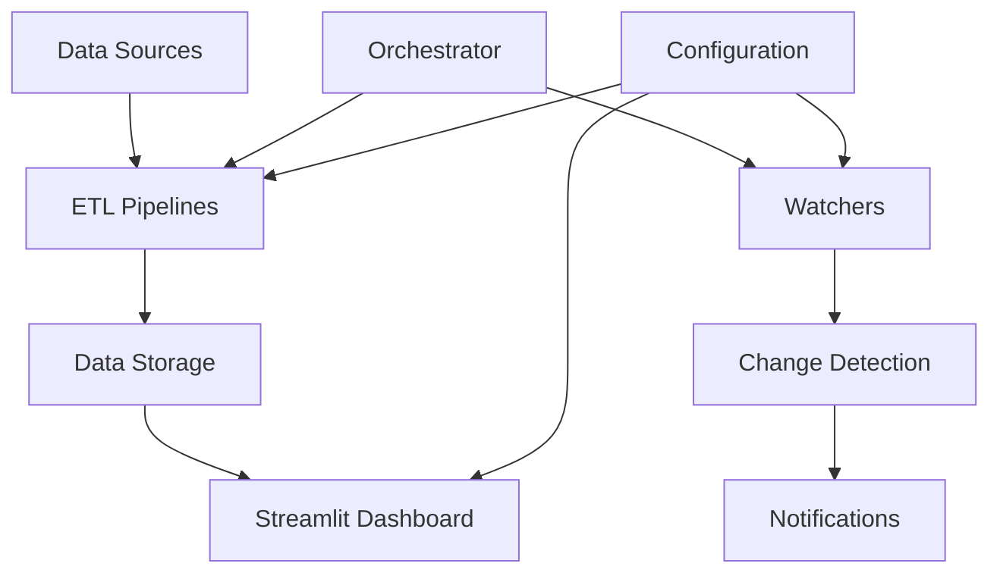

# Development Workflow Guide

A comprehensive guide for contributing to the Watchtower project, covering development practices, coding standards, and collaboration workflows.

## 📖 Related Documentation

- **[Contributing Guide](../../CONTRIBUTING.md)** - Start here for contribution overview
- **[Architecture Overview](architecture-overview.md)** - Understand the system design
- **[API Reference](api-reference.md)** - Detailed API documentation
- **[Setup Guide](../setup-guide.md)** - Installation and configuration
- **[Main Documentation](../README.md)** - Documentation hub

## 📋 Table of Contents

1. [Getting Started](#getting-started)
2. [Development Environment](#development-environment)
3. [Current Architecture](#current-architecture)
4. [Coding Standards](#coding-standards)
5. [Testing Workflow](#testing-workflow)
6. [Git Workflow](#git-workflow)
7. [Code Review Process](#code-review-process)
8. [Release Process](#release-process)
9. [Deployment and Automation](#deployment-and-automation)

---

## Getting Started

### Prerequisites for Contributors

```bash
# Required tools
Python 3.10+
Git
Poetry (recommended) or pip
VS Code or similar IDE

# Recommended VS Code extensions
ms-python.python
ms-python.ruff
ms-python.pylint
ms-toolsai.jupyter
ms-python.mypy-type-checker
```

### Initial Setup

```bash
# Fork and clone the repository
git clone https://github.com/your-username/watchtower.git
cd watchtower

# Setup development environment (Poetry recommended)
poetry install
poetry shell

# OR using venv
python -m venv .venv
source .venv/bin/activate  # Linux/Mac
.venv\Scripts\activate.bat  # Windows

# Install dependencies
pip install -e .
pip install -r requirements-dev.txt

# Install pre-commit hooks
pre-commit install

# Install Playwright browsers
playwright install

# Run initial tests to verify setup
python -m pytest Tests/unit/ -v
```

---

## Development Environment

### Current Project Structure

```
watchtower/
├── src/                           # Source code
│   ├── analytics/                 # Data analytics components
│   │   ├── __init__.py
│   │   ├── models.py              # Configuration models
│   │   └── settings.py            # Main settings with environment support
│   ├── data/                      # Data handling and connectors
│   ├── etl/                       # ETL pipelines
│   │   ├── arxiv/                 # arXiv paper extraction
│   │   ├── events/                # Event processing
│   │   ├── games/                 # Game deals and data
│   │   ├── goldigging/            # Investment/opportunity tracking
│   │   ├── news/                  # News aggregation
│   │   └── security/              # Security vulnerability tracking
│   ├── exceptions/                # Custom exception classes
│   ├── miners/                    # Specialized extraction tools
│   │   ├── asf-winonly/           # Steam Achievement Farm (Windows)
│   │   └── udemy-universal/       # Udemy course mining
│   ├── models/                    # Data models and schemas
│   ├── orchestrator/              # Task orchestration and scheduling
│   ├── utils/                     # Shared utilities
│   │   ├── file_system.py         # File system operations
│   │   ├── logging.py             # Centralized logging
│   │   ├── nlp_classifier.py      # NLP and ML utilities
│   │   └── recommender.py         # Recommendation engine
│   ├── watchers/                  # Content change monitoring
│   └── web/                       # Web applications
│       └── fullstreamlit/         # Main Streamlit dashboard
│           ├── components/        # Reusable UI components
│           ├── styles/            # CSS and styling
│           ├── utils/             # App-specific utilities
│           └── app.py             # Main application entry
├── data/                          # Data storage (git-ignored)
├── logs/                          # Application logs
├── Tests/                         # Test suite
│   ├── unit/                      # Unit tests
│   ├── integration/               # Integration tests
│   ├── etl/                       # ETL-specific tests
│   └── data/                      # Test data
├── docs/                          # Documentation
├── config/                        # Configuration files
├── .streamlit/                    # Streamlit configuration
└── automation scripts            # Various .bat/.sh/.ps1 files
```

### Configuration Management

Watchtower uses **Pydantic Settings** for robust configuration management:

```python
# Example: Using the configuration system
from src.config.settings import get_settings

def setup_component():
    settings = get_settings()
    
    # Access nested configurations
    db_url = settings.database.url
    log_level = settings.logging.level
    api_timeout = settings.api.timeout
    
    # Environment-specific settings
    if settings.is_development():
        # Development-specific logic
        pass
```

### Environment Variables

Create environment-specific `.env` files:

```bash
# .env (development)
ENVIRONMENT=development
DEBUG=true

# Database configuration
DATABASE__URL=sqlite:///watchtower_dev.db
DATABASE__ECHO=true

# Logging configuration
LOGGING__LEVEL=DEBUG
LOGGING__FILE_ENABLED=true
LOGGING__FILE_PATH=logs/watchtower.log

# ETL configuration
ETL__BATCH_SIZE=100
ETL__MAX_WORKERS=2
ETL__TIMEOUT=30

# Scraping configuration
SCRAPING__TIMEOUT=10
SCRAPING__MAX_RETRIES=3
SCRAPING__CONCURRENT_LIMIT=5
SCRAPING__USER_AGENT="Watchtower/0.1.0"

# Streamlit configuration
STREAMLIT__HOST=localhost
STREAMLIT__PORT=8501
STREAMLIT__DEBUG=true

# API configuration
API__HOST=0.0.0.0
API__PORT=8000
API__RELOAD=true
```

### Development Scripts

The project includes numerous automation scripts:

```bash
# Start Streamlit dashboard
./start_streamlit.sh         # Linux/Mac
./start_streamlit.bat        # Windows

# Run ETL pipelines
./run_all_etl.sh            # All ETL pipelines
./run_enhanced_arxiv_etl.py # Specific ETL

# Run watchers
./run_watcher.bat           # Start watchers

# Development utilities
./deduplicate_courses.sh    # Clean duplicate data
./manage_streamlit_service.sh # Service management
```

---

## Current Architecture

### Key Components

#### 1. Configuration System (`src/config/`)
- **Pydantic Settings**: Type-safe configuration with environment variable support
- **Nested Configuration**: Organized by component (database, logging, api, etc.)
- **Environment Detection**: Automatic development/production/testing modes

#### 2. ETL Framework (`src/etl/`)
- **Modular Pipelines**: Each source has its own ETL module
- **Base Classes**: Standardized extraction, transformation, and loading
- **Error Handling**: Comprehensive error handling with custom exceptions

#### 3. Watcher System (`src/watchers/`)
- **BaseWatcher**: Extensible base class for content monitoring
- **Event-Driven**: Change detection with notification support
- **Configurable**: Flexible monitoring intervals and criteria

#### 4. Web Dashboard (`src/web/fullstreamlit/`)
- **Multi-Component UI**: Modular Streamlit components
- **Real-time Data**: Live data visualization and interaction
- **Performance Optimized**: Caching and efficient data loading

#### 5. Orchestration (`src/orchestrator/`)
- **MetaOrchestrator**: Manages multiple task orchestrators
- **Fault Tolerance**: Auto-restart and error recovery
- **Scheduling**: Flexible task scheduling and execution

### Data Flow



---

## Coding Standards

### Python Style Guide

We follow **PEP 8** with **Ruff** for linting and **Black** for formatting:

#### 1. Tool Configuration

**pyproject.toml - Ruff Configuration**:
```toml
[tool.ruff]
line-length = 88
target-version = "py310"
select = [
    "E",   # pycodestyle errors
    "F",   # pyflakes
    "W",   # pycodestyle warnings 
    "I",   # isort
    "UP",  # pyupgrade
    "C4",  # flake8-comprehensions
    "B",   # flake8-bugbear
    "A",   # flake8-builtins
    "RUF", # Ruff-specific rules
    "N",   # pep8-naming
    "D",   # pydocstyle
    "PT",  # pytest style
    "SIM", # simplify
]

[tool.ruff.pydocstyle]
convention = "google"  # Google-style docstrings

[tool.mypy]
python_version = "3.10"
disallow_untyped_defs = true
check_untyped_defs = true
strict_optional = true
```

#### 2. Import Organization
```python
"""Module docstring explaining purpose."""

from __future__ import annotations

# Standard library imports
import os
import sys
from datetime import datetime
from pathlib import Path
from typing import Any, Dict, List, Optional, Union

# Third-party imports
import pandas as pd
import polars as pl
from pydantic import BaseModel

# Local imports
from src.config.settings import get_settings
from src.utils.logging import get_logger
from src.watchers.base_watcher import BaseWatcher
```

#### 3. Type Hints and Documentation
```python
from typing import Any, Dict, List, Optional, Union

# Type aliases for complex types
DataDict = Dict[str, Union[str, int, float, bool]]
ProcessedData = List[DataDict]

def process_data(
    input_data: List[Dict[str, Any]], 
    batch_size: int = 1000,
    timeout: Optional[int] = None
) -> ProcessedData:
    """Process data in configurable batches.
    
    Args:
        input_data: Raw data to process
        batch_size: Number of items per batch
        timeout: Processing timeout in seconds
        
    Returns:
        List of processed data dictionaries
        
    Raises:
        ProcessingError: If data processing fails
        TimeoutError: If processing exceeds timeout
        
    Example:
        >>> data = [{"id": 1, "value": "test"}]
        >>> result = process_data(data, batch_size=10)
        >>> len(result) == 1
        True
    """
    settings = get_settings()
    logger = get_logger(__name__)
    
    try:
        # Implementation with proper error handling
        pass
    except Exception as e:
        logger.error(f"Processing failed: {e}", exc_info=True)
        raise ProcessingError(f"Failed to process data: {e}") from e
```

#### 4. Configuration Usage Pattern
```python
from src.config.settings import get_settings

class DataProcessor:
    """Processes data with configurable options."""
    
    def __init__(self):
        """Initialize processor with current settings."""
        self.settings = get_settings()
        self.logger = get_logger(self.__class__.__name__)
        
        # Use configuration values
        self.batch_size = self.settings.etl.batch_size
        self.timeout = self.settings.etl.timeout
        self.max_workers = self.settings.etl.max_workers
    
    def process(self, data: List[Any]) -> List[Any]:
        """Process data using configured parameters."""
        self.logger.info(f"Processing {len(data)} items with batch size {self.batch_size}")
        # Implementation
```

#### 5. Error Handling Pattern
```python
from src.exceptions.etl import ExtractionError, ProcessingError

def extract_content(url: str) -> str:
    """Extract content with comprehensive error handling."""
    settings = get_settings()
    logger = get_logger(__name__)
    
    try:
        # Extraction logic
        return content
    except requests.RequestException as e:
        raise ExtractionError(
            message=f"Failed to fetch URL {url}",
            error_code="NETWORK_ERROR",
            context={"url": url, "timeout": settings.scraping.timeout}
        ) from e
    except Exception as e:
        logger.error(f"Unexpected error: {e}", exc_info=True)
        raise ProcessingError(f"Unexpected extraction error: {e}") from e
```

### Code Organization Patterns

#### 1. ETL Module Structure
```python
# src/etl/example/example_etl.py
"""Example ETL pipeline implementation."""

from typing import Any, Dict, List

from src.config.settings import get_settings
from src.etl.base import BaseETL
from src.utils.logging import get_logger

class ExampleETL(BaseETL):
    """ETL pipeline for Example data source."""
    
    def __init__(self, name: str = "example"):
        """Initialize ETL with configuration."""
        super().__init__(name)
        self.settings = get_settings()
        self.logger = get_logger(self.__class__.__name__)
    
    def extract(self) -> List[Dict[str, Any]]:
        """Extract data from source."""
        # Implementation
        pass
    
    def transform(self, data: List[Dict[str, Any]]) -> List[Dict[str, Any]]:
        """Transform extracted data."""
        # Implementation
        pass
    
    def load(self, data: List[Dict[str, Any]]) -> bool:
        """Load transformed data."""
        # Implementation
        pass
```

#### 2. Watcher Implementation
```python
# src/watchers/example_watcher.py
"""Example content watcher implementation."""

from typing import Any, Dict, Optional

from src.config.settings import get_settings
from src.watchers.base_watcher import BaseWatcher

class ExampleWatcher(BaseWatcher):
    """Monitors Example website for content changes."""
    
    def __init__(self, name: str = "example_watcher"):
        """Initialize watcher with configuration."""
        super().__init__(name)
        self.settings = get_settings()
    
    def check_for_changes(self) -> Optional[Dict[str, Any]]:
        """Check for content changes."""
        # Implementation
        pass
    
    def get_current_content(self) -> str:
        """Get current content for comparison."""
        # Implementation
        pass
```

---

## Testing Workflow

### Test Organization (Current Structure)

```
Tests/
├── unit/           # Unit tests for individual components
├── integration/    # Integration tests
├── etl/           # ETL-specific tests
└── data/          # Test data files
```

### Writing Tests

#### 1. Unit Test Example
```python
# Tests/unit/test_config.py
"""Tests for configuration management."""

import pytest
from unittest.mock import patch

from src.config.settings import Settings, get_settings

class TestSettings:
    """Test suite for Settings configuration."""
    
    def test_default_settings(self):
        """Test default configuration values."""
        settings = Settings()
        
        assert settings.app_name == "Watchtower"
        assert settings.app_version == "0.1.0"
        assert settings.environment.value == "development"
    
    def test_environment_variable_override(self):
        """Test environment variable configuration override."""
        with patch.dict('os.environ', {'DATABASE__URL': 'postgresql://test'}):
            settings = Settings()
            assert settings.database.url == 'postgresql://test'
    
    def test_settings_caching(self):
        """Test that get_settings returns cached instance."""
        settings1 = get_settings()
        settings2 = get_settings()
        
        assert settings1 is settings2
```

#### 2. ETL Integration Test
```python
# Tests/integration/test_arxiv_etl.py
"""Integration tests for arXiv ETL pipeline."""

import pytest
import tempfile
from pathlib import Path

from src.etl.arxiv.enhanced_arxiv_etl import EnhancedArxivETL

class TestArxivETLIntegration:
    """Integration tests for arXiv ETL."""
    
    @pytest.mark.integration
    def test_full_arxiv_pipeline(self):
        """Test complete arXiv ETL pipeline."""
        with tempfile.TemporaryDirectory() as temp_dir:
            etl = EnhancedArxivETL(
                name="test_arxiv",
                output_dir=Path(temp_dir)
            )
            
            # Execute pipeline
            metrics = etl.run()
            
            # Verify results
            assert metrics.is_successful
            assert metrics.records_extracted > 0
            assert (Path(temp_dir) / "arxiv_papers.json").exists()
```

### Running Tests

```bash
# Run all tests
poetry run pytest
# OR
python -m pytest

# Run with coverage
pytest --cov=src --cov-report=html --cov-report=term-missing

# Run specific test categories
pytest Tests/unit/ -v
pytest Tests/integration/ -v -m integration
pytest Tests/etl/ -v

# Run tests with specific markers
pytest -m "not slow" -v      # Skip slow tests
pytest -m "integration" -v   # Only integration tests
```

### Test Configuration

**pyproject.toml**:
```toml
[tool.pytest.ini_options]
minversion = "7.0"
addopts = "-ra -q --cov=src --cov-report=term-missing"
testpaths = ["Tests"]
python_files = "test_*.py"
python_classes = "Test*"
python_functions = "test_*"
markers = [
    "slow: marks tests as slow (deselect with '-m \"not slow\"')",
    "integration: marks tests as integration tests",
    "network: marks tests requiring network access",
]
```

---

## Git Workflow

### Branch Strategy

```
main                 # Production-ready code
├── develop          # Integration branch  
├── feature/xxx      # Feature development
├── bugfix/xxx       # Bug fixes
├── hotfix/xxx       # Critical production fixes
└── release/x.x.x    # Release preparation
```

### Commit Message Format

```
<type>(<scope>): <subject>

<body>

<footer>
```

**Examples**:
```bash
feat(etl): add enhanced arXiv paper classification

- Implement ML-based paper categorization
- Add confidence scoring for classifications
- Include bias detection and mitigation
- Add comprehensive logging and metrics

Closes #123

fix(watcher): handle connection timeouts gracefully

- Add exponential backoff retry logic
- Increase default timeout to 30 seconds
- Improve error logging with context
- Add connection health monitoring

Fixes #456

perf(streamlit): optimize dashboard data loading

- Implement smart caching for large datasets
- Add pagination for better performance
- Reduce initial load time by 60%
- Add loading progress indicators

Improves #789
```

---

## Code Review Process

### Pre-commit Hooks

The project uses comprehensive pre-commit hooks:

```yaml
# .pre-commit-config.yaml
repos:
-   repo: https://github.com/pre-commit/pre-commit-hooks
    rev: v4.6.0
    hooks:
    -   id: trailing-whitespace
    -   id: end-of-file-fixer
    -   id: check-yaml
    -   id: check-toml
    -   id: check-merge-conflict

-   repo: https://github.com/astral-sh/ruff-pre-commit
    rev: v0.5.5
    hooks:
    -   id: ruff
        args: [--fix, --exit-non-zero-on-fix]
    -   id: ruff-format

-   repo: https://github.com/psf/black
    rev: 24.8.0
    hooks:
    -   id: black

-   repo: https://github.com/pre-commit/mirrors-mypy
    rev: v1.11.0
    hooks:
    -   id: mypy
        args: [--strict]
```

### Pull Request Guidelines

#### 1. PR Description Template
```markdown
## Description
Brief description of changes and motivation

## Type of Change
- [ ] Bug fix (non-breaking change which fixes an issue)
- [ ] New feature (non-breaking change which adds functionality)
- [ ] Breaking change (fix or feature that would cause existing functionality to not work as expected)
- [ ] Documentation update
- [ ] Performance improvement
- [ ] Code refactoring

## Testing
- [ ] Unit tests added/updated and passing
- [ ] Integration tests added/updated and passing
- [ ] Manual testing completed
- [ ] All existing tests pass

## Configuration
- [ ] New configuration options documented
- [ ] Environment variables updated in .env.example
- [ ] Settings validation added

## Checklist
- [ ] Code follows the style guidelines (Ruff + Black)
- [ ] Self-review of code completed
- [ ] Code is commented, particularly in hard-to-understand areas
- [ ] Corresponding changes to documentation made
- [ ] No new warnings generated
- [ ] Pre-commit hooks pass

## Related Issues
Closes #123
Relates to #456
```

---

## Release Process

### Version Management

We use **Semantic Versioning** (SemVer):
- Current version: `0.1.0` (in pyproject.toml and src/__init__.py)
- `MAJOR.MINOR.PATCH`
- Pre-release: `0.1.0-alpha.1`, `0.1.0-beta.1`, `0.1.0-rc.1`

### Release Steps

#### 1. Prepare Release
```bash
# Update version in multiple files
# - pyproject.toml: version = "0.2.0"
# - src/__init__.py: __version__ = "0.2.0"

# Update CHANGELOG.md
# Run full test suite
poetry run pytest Tests/ -v --cov=src

# Test installation
poetry build
poetry install

# Test Streamlit app
poetry run streamlit run src/web/fullstreamlit/app.py
```

#### 2. Version Update Script
```python
# scripts/update_version.py
"""Script to update version across all files."""

import re
from pathlib import Path

def update_version(new_version: str):
    """Update version in all relevant files."""
    files_to_update = [
        ("pyproject.toml", r'version = ".*"', f'version = "{new_version}"'),
        ("src/__init__.py", r'__version__ = ".*"', f'__version__ = "{new_version}"'),
    ]
    
    for file_path, pattern, replacement in files_to_update:
        path = Path(file_path)
        content = path.read_text()
        updated = re.sub(pattern, replacement, content)
        path.write_text(updated)
        print(f"Updated {file_path}")

if __name__ == "__main__":
    import sys
    if len(sys.argv) != 2:
        print("Usage: python scripts/update_version.py 0.2.0")
        sys.exit(1)
    
    update_version(sys.argv[1])
```

---

## Deployment and Automation

### Current Automation Scripts

The project includes comprehensive automation:

#### 1. Streamlit Service Management
```bash
# Linux/Mac
./manage_streamlit_service.sh start    # Start service
./manage_streamlit_service.sh stop     # Stop service  
./manage_streamlit_service.sh restart  # Restart service

# Windows
./manage_streamlit_service.bat start
./manage_streamlit_service.bat stop
```

#### 2. ETL Pipeline Execution
```bash
# Run all ETL pipelines
./run_all_etl.sh           # Linux/Mac
./run_all_etl.bat          # Windows
./run_all_etl_powershell.ps1  # PowerShell

# Run specific ETL
python run_enhanced_arxiv_etl.py
python run_arxiv_etl.py
```

#### 3. Service Setup
```bash
# Setup Streamlit as a system service
./setup_streamlit_service.sh     # Linux (systemd)
./setup_streamlit_service.ps1    # Windows (Task Scheduler)

# Setup ETL scheduling
./setup_etl_scheduler.sh         # Linux (cron)
./setup_etl_scheduler.ps1        # Windows (Task Scheduler)
```

### Environment-Specific Configurations

#### Development
```bash
# .env.development
ENVIRONMENT=development
DEBUG=true
LOGGING__LEVEL=DEBUG
STREAMLIT__DEBUG=true
ETL__BATCH_SIZE=100
```

#### Production
```bash
# .env.production  
ENVIRONMENT=production
DEBUG=false
LOGGING__LEVEL=INFO
STREAMLIT__HOST=0.0.0.0
STREAMLIT__PORT=8501
ETL__BATCH_SIZE=1000
DATABASE__URL=postgresql://prod_server/watchtower
```

### Docker Support

```dockerfile
# Dockerfile (current structure)
FROM python:3.11-slim

WORKDIR /app
COPY pyproject.toml requirements*.txt ./
RUN pip install -r requirements.txt

COPY src/ ./src/
COPY data/ ./data/
COPY config/ ./config/

EXPOSE 8501
CMD ["streamlit", "run", "src/web/fullstreamlit/app.py", "--server.address", "0.0.0.0"]
```

---

## Best Practices Summary

### Development
- **Configuration-Driven**: Use the Pydantic settings system consistently
- **Type Safety**: Comprehensive type hints with mypy validation
- **Error Handling**: Custom exceptions with context and logging
- **Performance**: Polars for data processing, smart caching in Streamlit

### Code Quality
- **Automated Formatting**: Ruff + Black for consistent style
- **Pre-commit Hooks**: Catch issues before commit
- **Comprehensive Testing**: Unit, integration, and ETL-specific tests
- **Documentation**: Google-style docstrings and up-to-date README

### Architecture
- **Modular Design**: Clear separation of ETL, watchers, web, and utilities
- **Extensible Framework**: BaseWatcher and BaseETL for new implementations
- **Centralized Logging**: Consistent logging across all components
- **Service-Oriented**: Support for running as system services

### Automation
- **Cross-Platform Scripts**: Support for Windows (.bat), Linux/Mac (.sh), and PowerShell (.ps1)
- **Service Management**: Built-in service setup and management scripts
- **ETL Orchestration**: Automated pipeline execution and scheduling
- **Performance Monitoring**: Built-in benchmarking and optimization

This updated workflow guide reflects the current state of the Watchtower project, including its modern Python development practices, comprehensive configuration management, and robust automation infrastructure. 