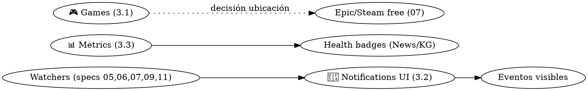

# Especificación — Componentes dormidos y funcionalidades sin tab (revival o eliminación)

> Fecha: 2026-08-17 · Estado: borrador para revisión · Ámbito: `src/web/dashboard/components/*` no conectados a `_TAB_RENDERERS` (app.py:526)

## 1. Contexto

El navbar conecta 13 tabs, pero `components/` contiene **~15 componentes más** con imports válidos y, en muchos casos, **ETLs vivos y registrados en el orquestador** que producen datos que nadie ve. Este documento los inventaría, decide (revival / eliminar) y especifica el revival de los elegidos. Además cubre dos "funcionalidades" transversales dormidas: el motor de recomendaciones (solo consumido como librería) y el sistema de alertas (UI desconectada).

**Situación paradójica actual:** se ejecutan ETLs de games, entertainment, museums, research (ADHD), intelligence (SEC/NVD/CISA), ecommerce (shoppy)… consumiendo recursos y generando datos bajo `data/` que el dashboard no muestra en ninguna parte. La API FastAPI (`/api/v1/games`, `/entertainment`, etc.) sí los expone — el gasto no es invisible, pero la UI propia no los aprovecha.

## 2. Inventario y veredicto

| Componente | Datos / ETL (registrado?) | Estado técnico | Veredicto | Prioridad |
|---|---|---|---|---|
| `games_tab.py` | 6 ETLs registrados: IsThereAnyDeal (API+RSS), Humble Bundles, itch.io trending, GOG RSS, Metacritic RSS, deals | Imports OK; `data/games/` ausente local (hay en server) | **REVIVIR** — mejor ROI del grupo: todo el pipeline existe | ⭐⭐⭐ |
| `notifications_tab.py` (524 l) | `src/alerts/engine.py` (AlertEngine) + `data/alerts/rules.json` | Desconectado "as per UI cleanup" (app.py:44); imports válidos; `data/alerts/` existe | **REVIVIR** — sin él, el sistema de alertas no tiene cara; múltiples specs (07/09/11) emiten eventos | ⭐⭐⭐ |
| `metrics_tab.py` | `data/**/output/run_summary_*.json` (escrito por todos los BaseETL) | Funciona con los run summaries existentes | **REVIVIR** — observabilidad de la plataforma en 1 click; además da contexto de frescura a todos los tabs | ⭐⭐⭐ |
| `watchers_tab.py` | `src/watchers/ms_skills_watcher.py` (registrado) | OK pero solo MS Skills | **REVIVIR ampliado** — unificar todos los `BaseWatcher` futuros (specs 05/06/07/09/11) en un tab "Watchers" | ⭐⭐ |
| `entertainment_tab.py` | 4-5 ETLs registrados (ecartelera cine, meme_economics, trakt, spotify) | Imports OK | **REVIVIR** (parcial: cine+memes) o mantener dormido — decidir por uso real | ⭐ |
| `intelligence_tab.py` | 5 ETLs registrados (SEC EDGAR, WHO, NVD CVE, security feeds) | Solo `data/security_feeds/` tiene datos hoy | **REVIVIR** como "🛡️ Security/Intel" — NVD+CISA+Krebs es el subconjunto con uso claro | ⭐⭐ |
| `recommendations_tab.py` | `src/recommendations/*` (activity_tracker, engine) | Funciona como librería (News related-content) | **REVIVIR como subtab/panel** "Para ti" — ver §4.1 | ⭐⭐ |
| `research_tab.py` (ADHD pubs + lugares) | 2 ETLs registrados (PubMed eutils; Foursquare/Yelp/Google) | Imports OK | **REVIVIR** si el interés ADHD/Neurodivergente sigue (existe `src/etl/neurodivergent/` — señal de que sí) | ⭐⭐ |
| `travel_tab.py` | viajeros_piratas (registrado) + gap gumroad | Cruza con Scavenging | **ELIMINAR** — fusionar en Scavenging/Deals (víajeros ya está allí) | — |
| `ecommerce_tab.py` | gumroad (registrado) + shoppy (registrado, sin consumidor) | Config drift (`viajeros_piratas` perdido) | **ELIMINAR** como tab; mover shoppy a Deals (spec 11 M2) | — |
| `crypto_tab.py` + `_basic` | miner crypto_sentiment registrado pero **escribe otros filenames** (mismatch total de rutas) | Roto por filename drift | **DECIDIR**: si hay interés crypto → arreglar rutas + CoinGecko (ver `docs/potentialsources/financial-market-sources.md`); si no, eliminar | ⭐ |
| `github_trending_tab.py` | **ETL borrado** (`github_trending_rss_etl.py` no existe; `__init__.py` del paquete rompería un import) | Datos imposibles de producir | **ELIMINAR** o reconstruir con feeds mshibanami/GitHubTrendingRSS; Knowledge Garden ya cubre Git Trends → recomiendo eliminar | — |
| `ai_research_tab.py` | **Sin productores** (huggingface/semantic_scholar no existen) | Renderizaría vacío | **ELIMINAR** — el camino correcto es ArXiv (spec 10) + enriquecimiento Semantic Scholar | — |
| `museums_tab.py` | `museum_etl` registrado (Wikidata SPARQL + Valencia cultural) | OK, datos casi vacíos | **DORMIR** (no borrar): interés episódico; documentar como "archived" | — |
| Legacy varios: `valencia_events_tab.py`, `notifications_tab_broken.py`, `rule_form_backup/broken.py`, `crypto_tab_basic.py`, `metrics_tab_minimal.py` | — | Código muerto confirmado | **ELIMINAR SIEMPRE** (higiene) | ⭐⭐⭐ |

**Regla propuesta:** todo componente dormido >6 meses sin plan de revival se elimina (git lo conserva); prohibidos los sufijos `_broken/_backup/_basic/_minimal` en `components/` (ya lo sugiere la skill `dashboard-tab`).

## 3. Especificaciones de revival

### 3.1 🎮 Games (revival inmediato)

**Por qué:** 6 ETLs registrados produciendo datos que solo la API expone; es la categoría de "scavenging" con pipelines ya pagados.

**Plan:**
1. Import + render en `app.py` (Obligations 2 y 3 de la skill dashboard-tab), tab perezoso `TAB_RENDERERS["tab-games"]`.
2. Subtabs existentes del componente (deals/bundles/new_releases/metacritic/itchio) — validar rutas de datos contra los ETLs reales (audit `stale_sources_report.txt`).
3. Mejoras mínimas v1: búsqueda por título, filtros por tienda, precio con descuento badge, paginación native DataTable (patrón Ayudas).
4. **Cruce clave con Scavenging:** Epic/Steam free (spec 07 §2) pueden listar aquí O en Scavenging — decisión: ofertas GRATIS en Scavenging (acción: reclamar), precios/descuentos comerciales en Games (decisión: comprar).
5. Funcionalidad nueva v2: wishlist con alerta de precio (watcher) — "avísame cuando X baje de Y€" (IsThereAnyDeal tiene historical low; su API ya integrada).

**Aceptación:** tab renderiza con datos reales de ≥3 fuentes; wishlist persistente; alerta de precio dispara evento de watcher.
**Esfuerzo:** M (revival) + M (wishlist).

### 3.2 🔔 Notifications / Alertas (revival inmediato)

**Por qué:** es la pieza que convierte el dashboard de "lector" a "plataforma activa". Las specs 05/06/07/09/11 proponen watchers que emiten eventos: sin UI de reglas/eventos, no hay bucle.

**Plan:**
1. Reconectar `notifications_tab.py` (el vivo, no el `_broken`) — reglas CRUD sobre `data/alerts/rules.json` con `AlertEngine`.
2. Sustituir `rule_form.py` (muerto) o completarlo como editor modal de condiciones (source/keyword/category/price ya modelados en `src/alerts/models`).
3. Vista "Eventos": consumir `data/watchers/*/events/*.json` (los que generen los watchers nuevos) + run failures del orquestador → bandeja unificada con filtro por severidad y "marcar leído" (localStorage).
4. Canales de salida v1: solo bandeja + archivo JSON. v2 (opcional): email SMTP/Telegram bot vía env vars — decisión explícita del usuario antes de implementar (acción externa).

**Aceptación:** crear/editar/borrar regla que dispare en <5 min ante un evento simulado; bandeja muestra eventos de ≥2 watchers.
**Esfuerzo:** M (reconexión+eventos) + M (editor completo).

### 3.3 📊 Metrics / Salud de plataforma (revival inmediato)

**Por qué:** todos los BaseETL escriben `run_summary_*.json`; este tab los agrega en time-series de duración/éxitos/errores. Es el tab que responde "¿por qué este subtab está vacío?".

**Plan:** reconectar `metrics_tab.py`; añadir tarjeta "última ejecución por ETL" y link desde los health badges propuestos en News F4 / KG F4; opcional: página de "staleness" consumiendo `scripts/audit_stale_sources.py` (ya existe) para listar fuentes muertas.
**Aceptación:** gráfica de éxito/fracaso por día; tabla por ETL con última ejecución y estado.
**Esfuerzo:** B–M.

### 3.4 🛡️ Security/Intel (revival acotado)

Subconjunto del intelligence_tab: NVD CVE (recientes por severidad), CISA advisories, Krebs/TheHackersNews/BleepingComputer (ya hay datos de security_feeds). Dejar SEC EDGAR/WHO tras config (interés menor). Subtabs: CVEs críticos del día/semana, Advisories, News. Filtro CVSS ≥ X y por keyword de producto (ej. "docker", "nginx" — homelab relevance).
**Aceptación:** CVEs del día con CVSS y link NVD; filtro por keyword operativo.
**Esfuerzo:** M.

### 3.5 🧠 Research (ADHD/Neurodivergent)

Publicaciones PubMed (ETL funcionando) + lugares ADHD-friendly (requiere API keys de Foursquare/Yelp/Google — evaluar coste/beneficio; quizá solo Google Places). V1: solo PubMed con búsqueda/filtros fecha. **Decisión pendiente del usuario** (interés personal).
**Esfuerzo:** B (v1 PubMed).

### 3.6 ✨ Recommendations ("Para ti")

El motor ya existe y tiene un manager singleton. Revival como panel en el home o subtab de Knowledge Garden: recomendaciones basadas en clicks guardados (activity_tracker ya instrumenta? verificar wiring) + "guardados" de las specs (KG F3, AR3, F2). v1 estática (top-N del engine al cargar), v2 con feedback 👍👎.
**Esfuerzo:** B (v1).

## 4. Dependencias entre revivals

Notificación UI primero: es el multiplicador de todos los watchers propuestos en las demás specs.

## 5. Roadmap

| Horizonte | Acciones |
|---|---|
| **Quick wins** | Eliminar TODOS los legacy `_broken/_backup/_basic/_minimal` + `github_trending/__init__` roto + docstring Streamlit; decidir crypto con el usuario |
| **Corto plazo** | Revivir Metrics (3.3), Notifications (3.2), Games (3.1) — los tres ⭐⭐⭐ |
| **Medio plazo** | Security/Intel acotado (3.4), Recommendations panel (3.6), Watchers unificados (3.4 de inventory) |
| **Estratégico** | Research ADHD v1 si hay interés; entertainment por decisión de uso; eliminar travel/ecommerce como tabs tras mover shoppy→Deals y viajeros→Scavenging |

**Criterios de éxito:** 0 ETLs registrados sin consumidor visible (UI o eliminación del ETL); 0 sufijos `_broken/_backup`; el sistema de alertas end-to-end (regla→evento→bandeja) demostrable.
